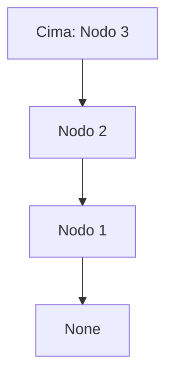

# 🦀 Estructuras de Datos en Rust: Repaso

¡Bienvenido al repositorio de repaso de estructuras de datos fundamentales implementadas en **Rust**! 🚀

Este proyecto contiene ejemplos prácticos, funcionales y bien documentados sobre cómo construir estructuras de datos enlazadas utilizando conceptos robustos de Rust, como el manejo seguro de memoria mediante `Option` y `Box`.

---

## 📚 1. Pilas (Stacks)

📝 **Archivo:** `pilas.rs`

Una pila es una estructura de datos de tipo **LIFO** (Last In, First Out - Último en entrar, primero en salir). Funciona como una pila de platos: el último plato que colocas en la cima es el primero que debes retirar.

### ✨ Implementación y Explicación de Código:

Para entender cómo funciona la pila, veamos el código comentado:

#### Operación de Inserción (Push)

```rust
    fn insertar(&mut self, valor: i32) {
        //crea un nuevo nodo y lo inserta al inicio de la pila
        let nuevo = Box::new(Nodo {
            valor,
            //take() toma el valor de la cima y lo asigna al nuevo nodo
            siguiente: self.cima.take(),
        });

        //asigna el nuevo nodo a la cima
        self.cima = Some(nuevo);
    }
```

Aquí agregamos elementos encima de los anteriores. `.take()` es una herramienta mágica de Rust: toma la propiedad del valor dentro de `Option` y deja un `None` en su lugar. Esto nos permite conectar de forma segura el nodo viejo abajo del nuevo, sin conflictos de memoria.

#### Operación de Eliminación (Pop)

```rust
    fn eliminar(&mut self) -> Option<i32> {
        //elimina el primer elemento de la pila
        match self.cima.take() {
            Some(nodo) => {
                //asigna el siguiente nodo a la cima
                self.cima = nodo.siguiente;
                //retorna el valor del nodo eliminado la instruccion Some es para retornar un valor
                Some(nodo.valor)
            }
            None => None,
        }
    }
```

Al hacer un `match` con la cima sacada con `take()`, podemos ver si había o no un nodo. Si lo había (`Some`), subimos el piso de abajo para que sea la cima, y devolvemos su valor.



---

## 🔗 2. Lista Simplemente Enlazada (Singly Linked List)

📝 **Archivo:** `ListaSimple.rs`

Una lista simple es una colección lineal de nodos, donde cada nodo contiene un valor y una referencia (o puntero) al siguiente nodo de la secuencia.

### ✨ Implementación y Explicación de Código:

#### Estructura Principal del Nodo

```rust
// Definición de un nodo de la lista
struct Nodo {
    valor: i32, // valor que guarda el nodo (un número entero)

    // puntero al siguiente nodo
    // Option significa que puede haber un nodo (Some) o no haber (None)
    // Box guarda el nodo en el heap (memoria dinámica)
    //la diferencia entre box y Rc<RefCell<Nodo>> es que box es un puntero de propiedad
    //y Rc<RefCell<Nodo>> es un puntero de referencia
    siguiente: Option<Box<Nodo>>,
}
```

Como explican los comentarios, Rust nos exige ser precisos con la memoria: `Option` controla la "existencia" del nodo a continuación, y `Box` acomoda recursivamente la estructura mandándola al Heap.

#### Método de Búsqueda

```rust
    // buscar un valor dentro de la lista
    fn buscar(&self, valor: i32) -> Option<&Nodo> {
        // empieza desde la cabeza
        let mut actual = &self.cabezera;

        // recorre todos los nodos
        while let Some(nodo) = actual {
            // si el valor coincide
            if nodo.valor == valor {
                // retorna referencia al nodo encontrado
                return Some(nodo);
            }

            // pasa al siguiente nodo
            actual = &nodo.siguiente;
        }

        // si no encontró el valor retorna None
        None
    }
```

Iteramos la lista prestando la variable con `&self` (referencia inmutable, "Borrowing" en Rust). Esto nos permite ojear los elementos sin sacarlos o eliminarlos de la memoria, saltando de caja en caja.


---

## 🔄 3. Lista Circular Simple (Circular Linked List)

📝 **Archivo:** `ListaCircularSimple.rs`

Una lista circular simple es una variación de la lista enlazada donde **el último nodo apunta de regreso al primer nodo (la cabeza)**, formando un ciclo contínuo.

### ✨ Implementación y Explicación de Código:

Para implementar una verdadera lista circular en Rust (donde el último nodo apunta al inicio) sorteando el sistema estricto de _Ownership_ y evitar recurrir a bloques `unsafe`, implementamos la memoria compartida a través de `Rc` y `RefCell`.

#### Estructura Principal del Nodo y la Lista

```rust
use std::rc::Rc;
use std::cell::RefCell;

struct Nodo {
    valor: i32,
    // Option -> puede ser Some(nodo) o None
    // Rc -> permite múltiples dueños del mismo dato
    // RefCell -> mutabilidad interior en memoria compartida
    siguiente: Option<Rc<RefCell<Nodo>>>,
}

struct ListaCircular {
    cabeza: Option<Rc<RefCell<Nodo>>>,
    cola: Option<Rc<RefCell<Nodo>>>, // mantenemos la cola para agilizar las inserciones al final
    size: usize,
}
```

Con `Rc`, podemos generar múltiples referencias estables a un mismo nodo compartiendo la misma memoria (ref-counting), permitiendo el cierre del ciclo de la cola a la cabeza; con `RefCell`, logramos modificar los enlaces de nuestros nodos de forma segura en tiempo de ejecución, a pesar de que solo contemos con punteros o iteradores que de otra forma hubiesen bloqueado la mutabilidad.

#### Operación de Inserción (Al Final)

```rust
    fn insertar(&mut self, valor: i32) {
        let nuevo = Rc::new(RefCell::new(Nodo {
            valor,
            siguiente: None,
        }));

        match self.cola.take() {
            Some(vieja_cola) => {
                // Si la lista ya tiene elementos, el último ahora apunta al nuevo
                vieja_cola.borrow_mut().siguiente = Some(nuevo.clone());
                self.cola = Some(nuevo.clone());

                // Conectamos de nuevo la cola con la cabeza para cerrar el círculo
                self.cola.as_ref().unwrap().borrow_mut().siguiente = self.cabeza.clone();
            }
            None => {
                // Si la lista está vacía, el nuevo nodo es tanto cabeza como cola
                self.cabeza = Some(nuevo.clone());
                self.cola = Some(nuevo.clone());

                // El nodo apunta a sí mismo (ciclo de un solo nodo)
                nuevo.borrow_mut().siguiente = Some(nuevo.clone());
            }
        }
        self.size += 1;
    }
```

La mutabilidad compartida brilla aquí: tomamos `self.cola` y mutamos el puntero que llevaba guardado su interior utilizando `borrow_mut()` (provisto por `RefCell`), redireccionándolo hacia la cabeza guardada para crear ese ciclo seguro en memoria cerrando la estructura circular perfectamente.

---

## 🚀 ¿Cómo ejecutar?

```bash
rustc pilas.rs && ./pilas
rustc ListaSimple.rs && ./ListaSimple
rustc ListaCircularSimple.rs && ./ListaCircularSimple
```
